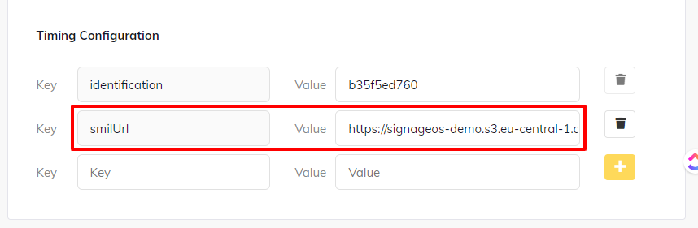

# Build and Deploy the SMIL Player Applet

Following guide provides steps to build your version of SMIL Player from Github repository and uploading it to signageOS DevSpace.

## Prerequisites:

1. signageOS Account
1. created Organization in Box (create one here)
1. Node.js >= 16
1. NPM
1. a shell/terminal environment (like bash, zsh, powershell...)
1. a source-code editor (like VSCode, Sublime, WebStorm...)

## Create an Applet
1. First, navigate to signageOS Box -> Applets -> [New Applet](https://box.signageos.io/applet/new)
1. Create a new Applet
1. Once created, get the Applet UID, we will need it later in the process in Step 5

## Clone signageOS SMIL Player repository
In your favorite terminal, use the following commands:

```shell title="Clonning from official SMIL Player repository"
git clone https://github.com/signageos/smil-player.git
cd ./smil-player
```

The repository is located on signageOS Github account: [https://github.com/signageos/smil-player](https://github.com/signageos/smil-player)

## Install signageOS CLI and additional libraries

```shell
npm install @signageos/cli@latest -g
npm i -SE @signageos/front-display
npm i -SE @signageos/front-applet
```

## Initiate signageOS CLI and login

Login with your signageOS Account and follow the guide in the terminal
```shell
sos login
```

Select your Organization under which you generated your Applet in 
the step 1

```shell
sos organization set-default
```

## Build the project and test it locally

To run the SMIL Player, make sure you build it first.

```shell
npm install && npm run build

sos applet start --applet-dir dist --entry-file-path dist/index.html
```

Now you should be able to open up your web browser on http://Your-IP-Address:8090 and see the project running. Do your changes, if necessary, and continue with the next step.

## Login to signageOS CLI and upload your version to signageOS

### Adjust package.json file

1. Open up package.json file in the root folder of the project
1. Check the 5th line main and make sure there is dist/index.html
1. Change the appletUid to YOUR Applet UID from the Step 1

```json title="Add your Applet UID into package.json"
{
  "name": "@signageos/smil-player",
  "version": "5.2.0",
  "description": "SMIL player",
  // highlight-start
  "main": "dist/index.html",
  // highlight-end
  "files": [
    "dist",
    "README.md",
    "CHANGELOG.md",
    "package.json"
  ],
  ...
    omited items..
  ...
  "sos": {
    // highlight-start
    "appletUid": "41240bf563bac504af...e06dfeb6824"
    // highlight-end
  }
}
```

### Upload to signageOS

Make sure you build your project before running the sos applet upload.

```shell
// build the project
npm run build-prod

// upload to signageOS
sos applet upload --entry-file-path dist/index.html
```

Now you have successfully uploaded your SMIL Player into signageOS and you can start deploying it to a supported
device.

## Deploy to a device

Once your SMIL Playlist is uploaded to a server (local server, AWS S3, Azure Storage, or similar — see the
[Hello World tutorial](hello-world-playlist.md)), you can deploy your SMIL Player Applet to
[any device via Timing](https://docs.signageos.io/hc/en-us/articles/4405026786706), or build your own native app —
[Core Apps](https://docs.signageos.io/hc/en-us/articles/4405245195666).

If you are using Timing to deploy your SMIL Player, add a Timing Configuration `smilUrl` and pass the link to your
SMIL playlist as its value.

By doing so, the SMIL playlist will be persistent throughout reboots. And, of course, you can change it from Box
anytime in the future.

