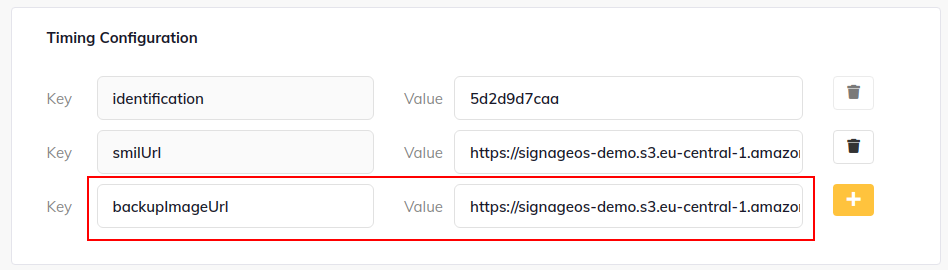

# Backup Image

The SMIL player has the option to set up a backup image to avoid a black screen if something goes wrong during the SMIL
file download (e.g., the file does not exist) or during XML to JSON conversion (e.g., invalid XML).

A default backup image is provided by SignageOs, which is locally stored in the SMIL player's repository.

Currently, only a single image is supported.

## Fallback Mechanisms

The SMIL Player provides two fallback mechanisms for handling errors:

### 1. Backup Image (Default Behavior)
When an invalid SMIL file is encountered (either during initial load or update), the player displays a backup image. This prevents black screens but interrupts the current content.

### 2. Fallback to Previous Playlist (Optional)
When `fallbackToPreviousPlaylist="true"` is configured in the refresh meta tag, the player continues playing the current valid playlist if an invalid SMIL update is received. This provides seamless continuity without interruption.

```xml
<!-- Enable fallback to previous playlist -->
<meta http-equiv="Refresh" content="60" fallbackToPreviousPlaylist="true"/>
```

**When to use each approach:**
- **Backup Image**: Use for initial deployment or when you want clear visual feedback that something is wrong
- **Fallback to Previous**: Use in production when display continuity is critical and temporary deployment issues shouldn't disrupt playback

See [Updating SMIL Playlist](../configuration-caching/updating-smil-playlist.md#fallback-to-previous-playlist) for more details on the fallback to previous playlist feature.

## Setup

There are two options for setting up your backup image.

There are two options how you can setup your backup image.

### Option 1 - Image stored locally in SMIL repository

Store the image locally in the `public/backupImage/backupImage.jpg` file. The name of the backup image has to be
`backupImage.jpg` at the moment.

### Option 2 - Provide URL to image via timings in Box

The URL has to be stored in the `backupImageUrl` variable in timings in the applet definition. The name of the file does
not matter in this case.


