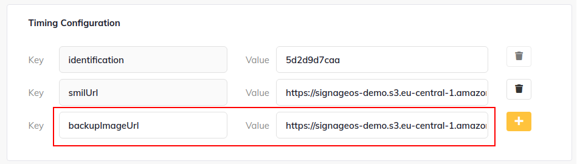

# Backup Image

The SMIL player has the option to set up a backup image to avoid a black screen if something goes wrong during the SMIL
file download (e.g., the file does not exist) or during XML to JSON conversion (e.g., invalid XML).

A default backup image is provided by SignageOs, which is locally stored in the SMIL player's repository.

## Setup

There are two options for setting up your backup image.

### Option 1 - Image stored locally in SMIL repository

Store images locally in the `public/backupImage/` directory. The player supports separate landscape and portrait
images and automatically selects the correct one based on viewport orientation (comparing viewport width vs height):

- `backupImage_landscape.jpg` — used when viewport width >= viewport height
- `backupImage_portrait.jpg` — used when viewport width < viewport height

### Option 2 - Provide URL to image via timings in Box

The URL has to be stored in the `backupImageUrl` variable in timings in the applet definition. The name of the file does
not matter in this case.

