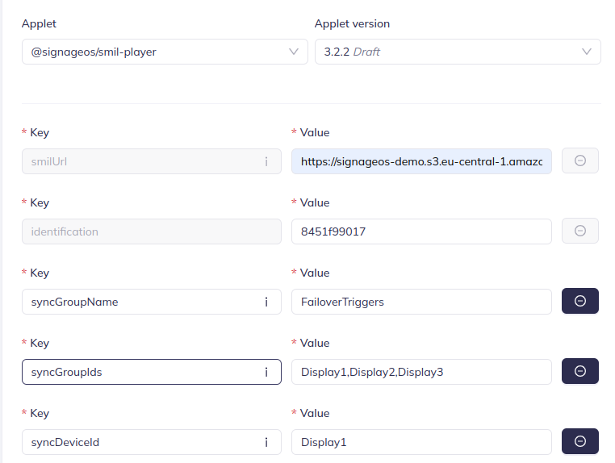

# Trigger failover

Sync group playback enables multiple devices to play content simultaneously, maintaining precise synchronization across
all devices. A failover mechanism ensures that if one device in the group turns off or disconnects, another device
assumes responsibility for playback without interrupting the experience.

SMIL player leverages trigger functionality to dynamically switch between playlists in the event of a failover.

### Define list of failover triggers

For the purpose of this documentation, let's assume we have a sync group with 3 devices, marked as: **Display1,
Display2,
Display3**. Code snippets are taken from **Display1** SMIL file. At the end of the document, you will find the complete
implementation for all devices also with timing setup.

#### Trigger setup

```xml

<triggers>
    <trigger id="triggerDisplay3" condition="or">
        <condition origin="sync" data="Display3"/>
    </trigger>
    <trigger id="triggerDisplay2Display3" condition="or">
        <condition origin="sync" data="Display2Display3"/>
    </trigger>
</triggers>
```

- **id** = unique identifier for the trigger, used to reference the trigger in the playlist
- **condition** = logical operator to combine multiple conditions
- **origin** = marks trigger as a sync trigger to use sync group functionality
- **data** = ID of the device which has issues playing content

#### Explanation

If Display3 has issues playing content, triggerDisplay3 takes over and plays.
If both Display2 and Display3 have issues playing content, take over and play triggerDisplay2Display3.

### Define region for triggered content

Read more about regions for triggered content in
the [Triggers article](https://docs.signageos.io/hc/en-us/articles/4405241368978).

```xml

<layout>
    <root-layout height="1080" width="1920"/>
    <region regionName="video" left="10" top="10" width="1280" height="720" z-index="1"
            mediaAlign="topLeft">
        <region regionName="video1" left="0" top="0" width="1280" height="720" z-index="1"
        />
    </region>
</layout>
```

### Define content triggered by the keyboard trigger

- The behavior for this trigger is that it will play the content section indefinitely, or until Display3 recovers and is
  able

- The behavior for this trigger is that it will play the content section indefinitely, or until Display3 recovers and is
  able
  to play
  its own playback again.

```xml

<par>
    <seq begin="triggerDisplay3" dur="indefinite">
        
        </img>
        
        </img>
    </seq>
</par>

```

It's important to have a unique syncGroupName for each group of devices which should be synchronized, so devices are not
mixed with another group of devices which should be synchronized in different group.

### Applet setup


