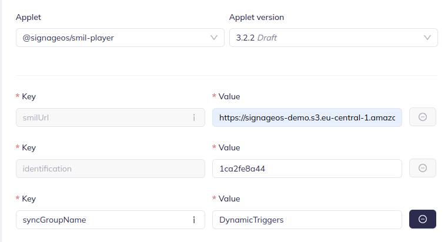

## Dynamic Synchronization

This functionality is a multi-device synchronized playback system where one device (
the master) orchestrates playback on other devices (slaves). Each slave device plays default content until the master
device sends a
command specifying which content to play and when to start and when to stop.\
The content on the master device and each
of the slave devices can be different, but it's important that corresponding parts of playlists have the **same**
duration.
Otherwise, playback will be out of sync and will not work as expected.

### System overview

The system is designed with a hierarchical master-slave model.

**Master Device**: Manages a playlist, synchronizes content, and sends commands to slave devices. Has all the
information about dynamic synchronized content and is also able to play content specific only to master device.
**Slave Devices**: Play default content and execute commands received from the Master. Does not have any knowledge about
when to start or when to end dynamic synchronized content.

Communication between the devices is achieved through peer-to-peer (P2P) communication over
a local network.

### Regions definition

Dynamic content is considered triggered content so it has to be played in a sub-region as shown bellow.
Currently only fullscreen sub-region is supported and it has to ba named `fullScreenTrigger`. Otherwise, dynamic
synchronization will not work.
The sub-region also has to be marked as `sync="true"` so the player synchronizes content in this region.

```xml

<layout>
    <root-layout width="1920" height="1080"/>
    <region regionName="cl2q7jqlu15755811xklizc1al4d" left="0" top="0" width="1920" height="1080" z-index="1"
    >
        <region regionName="fullScreenTrigger" left="0" top="0" width="1920" height="1080" z-index="1"
                sync="true"/>
    </region>
</layout>

```

### Dynamic content

It's marked in the SMIL file with the `emitDynamic` tag.

```xml

<seq>
    <emitDynamic data="dynamic_cm3mna5wb004tawwagb4nk7ya"
                 syncId="clh0lp18u67001xm310yg8pbi"/>
</seq>

```

### Dynamic content corresponding playlist

Smil xml definition has to contain corresponding playlist, which has to be marked with the same Id, as its specified in
`emitDynamic` tags `data` attribute.

This playlist will play 4 videos in the `fullScreenTrigger` region on the master device.\
Master device will send command to start playing playlist with id `dynamic_cm3mna5wb004tawwagb4nk7ya`.\

Playlist on the slave device has to be marked with the same Id, which is stored in `begin` attribute, so
`dynamic_cm3mna5wb004tawwagb4nk7ya` in this case.\
Playlist on the slave device can have different content, but its
duration has to be same as on master device.
Otherwise playback will be out of sync and will not work as expected and also master will cancel playback on the slave
device when it finishes playing so slave device would not play the whole content.

```xml

<seq repeatCount="1" begin="dynamic_cm3mna5wb004tawwagb4nk7ya" end="dynamic2">
    <video src="srcToVideo" region="clgmkrvsh4827581xmz267xq5a7"/>
    <video src="srcToVideo" region="clgmkrvsh4827581xmz267xq5a7"/>
    <video src="srcToVideo" region="clgmkrvsh4827581xmz267xq5a7"/>
    <video src="srcToVideo" region="clgmkrvsh4827581xmz267xq5a7"/>
</seq>
```

### Applet setup

It's important to have unique syncGroupName for each group of devices which should be synchronized so devices are not
mixed with another group of devices that should be synchronized in a different group.


