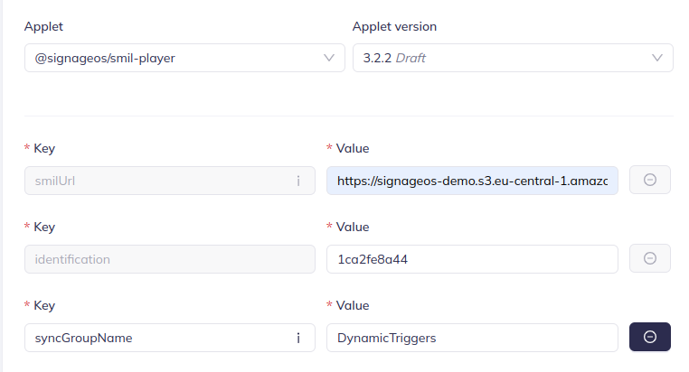

# Dynamic Synchronization

This functionality is a multi-device synchronized playback system where one device (
the master) orchestrates playback on other devices (slaves). Each slave device plays default content until the master
device sends a
command specifying which content to play and when to start and when to stop.
The content on the master device and each
of the slave devices can be different, but it's important that corresponding parts of playlists have the **same**
duration.
Otherwise, playback will be out of sync and will not work as expected.

### System overview

The system is designed with a hierarchical master-slave model.

**Master Device**: The device whose SMIL playlist contains the `emitDynamic` tag. It decides *when* dynamic content
starts and stops, and broadcasts those commands to the group. It has all the information about dynamic synchronized
content and is also able to play content specific only to the master device.
**Slave Devices**: Play default content and execute commands received from the Master. Does not have any knowledge about
when to start or when to end dynamic synchronized content.

While dynamic content plays, the master re-broadcasts its start command every second as a keepalive. A slave that has
not heard from the master for ~2.5 seconds cancels the dynamic content locally and returns to its default content —
so a dead master cannot leave slaves stuck on dynamic content.

Communication uses the same transport as playback synchronization: with `syncServerUrl` configured, devices coordinate
through the synchronization server (works across networks); without it, they use peer-to-peer communication over the
local network. See [Playback Synchronization](playback-synchronization.md).

Dynamic synchronization is built on top of the playback-sync machinery, so it requires a working sync setup:
`syncGroupName` must be configured and the `fullScreenTrigger` sub-region must have `sync="true"` — without these the
`emitDynamic` tag is ignored.

### Regions definition

Dynamic content is considered triggered content so it has to be played in a sub-region as shown bellow.
Currently only fullscreen sub-region is supported and it has to ba named `fullScreenTrigger`. Otherwise, dynamic
synchronization will not work.
The sub-region also has to be marked as `sync="true"` so the player synchronizes content in this region.

```xml

<layout>
    <root-layout width="1920" height="1080"/>
    <region regionName="cl2q7jqlu15755811xklizc1al4d" left="0" top="0" width="1920" height="1080" z-index="1"
    >
        <region regionName="fullScreenTrigger" left="0" top="0" width="1920" height="1080" z-index="1"
                sync="true"/>
    </region>
</layout>

```

### Dynamic content

It's marked in the SMIL file with the `emitDynamic` tag (placed only in the **master** device's playlist).

```xml

<seq>
    <emitDynamic data="dynamic_cm3mna5wb004tawwagb4nk7ya"
                 syncId="clh0lp18u67001xm310yg8pbi"/>
</seq>

```

Notes on the attributes:

- `data` — the id of the dynamic playlist to start. Ids must start with the `dynamic` prefix. The value may also be a
  **comma-separated list** of ids; each device plays whichever id exists in its own SMIL file, which lets one command
  trigger different (same-duration) playlists on different devices.
- `syncId` — optional group discriminator; devices sharing the same `syncId` coordinate this dynamic content together.

### Dynamic content corresponding playlist

Smil xml definition has to contain corresponding playlist, which has to be marked with the same Id, as its specified in
`emitDynamic` tags `data` attribute.

This playlist will play 4 videos in the `fullScreenTrigger` region on the master device.
Master device will send command to start playing playlist with id `dynamic_cm3mna5wb004tawwagb4nk7ya`.

Playlist on the slave device has to be marked with the same Id, which is stored in `begin` attribute, so
`dynamic_cm3mna5wb004tawwagb4nk7ya` in this case.
Playlist on the slave device can have different content, but its
duration has to be same as on master device.
Otherwise playback will be out of sync and will not work as expected and also master will cancel playback on the slave
device when it finishes playing so slave device would not play the whole content.

```xml

<seq repeatCount="1" begin="dynamic_cm3mna5wb004tawwagb4nk7ya" end="dynamic2">
    <video src="srcToVideo" region="clgmkrvsh4827581xmz267xq5a7"/>
    <video src="srcToVideo" region="clgmkrvsh4827581xmz267xq5a7"/>
    <video src="srcToVideo" region="clgmkrvsh4827581xmz267xq5a7"/>
    <video src="srcToVideo" region="clgmkrvsh4827581xmz267xq5a7"/>
</seq>
```

Two details of this example worth spelling out:

- The media declare the **parent** region (`clgmkrvsh4827581xmz267xq5a7`) as their `region`; at runtime the player
  reassigns dynamic content into the `fullScreenTrigger` sub-region automatically.
- The optional `end` attribute names **another dynamic playlist id**: when that other dynamic playlist starts, it
  cancels this one (cross-cancellation). In the example, starting `dynamic2` stops
  `dynamic_cm3mna5wb004tawwagb4nk7ya`. Dynamic content also plays at the highest internal priority, temporarily
  deferring regular content in the region.

### Applet setup



For device failover instead of content-level switching, see [Trigger failover](failover.md).
