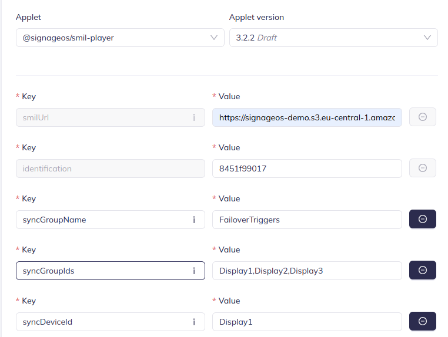

# Trigger failover

Sync group playback enables multiple devices to play content simultaneously, maintaining precise synchronization across
all devices. A failover mechanism ensures that if one device in the group turns off or disconnects, another device
assumes responsibility for playback without interrupting the experience.

This failover mechanism is a synchronization feature, but it is implemented with trigger syntax — see
[Triggers and Interactivity](../triggers/overview.md) for the general trigger model. SMIL player leverages that
trigger functionality to dynamically switch between playlists in the event of a failover.

### Define list of failover triggers

For the purpose of this documentation, let's assume we have a sync group with 3 devices, marked as: **Display1,
Display2, Display3**. Code snippets are taken from **Display1** SMIL file.

#### Trigger setup

```xml

<triggers>
    <trigger id="triggerDisplay3" condition="or">
        <condition origin="sync" data="Display3"/>
    </trigger>
    <trigger id="triggerDisplay2Display3" condition="or">
        <condition origin="sync" data="Display2Display3"/>
    </trigger>
</triggers>
```

- **id** = unique identifier for the trigger, used to reference the trigger in the playlist
- **condition** = logical operator to combine multiple conditions
- **origin** = marks trigger as a sync trigger to use sync group functionality
- **data** = identifier(s) of the missing device(s). For multiple devices, concatenate their ids **sorted
  alphabetically, with no separator** — the player builds the lookup key as `sort + join`, so
  `data="Display2Display3"` fires but `data="Display3Display2"` never matches.

#### Explanation

If Display3 has issues playing content, triggerDisplay3 takes over and plays.
If both Display2 and Display3 have issues playing content, take over and play triggerDisplay2Display3. To cover every
failure combination in a 3-device group, define a trigger for each subset of the *other* devices (e.g. on Display1:
`Display2`, `Display3`, `Display2Display3`).

#### Required applet configuration

Failover triggers only work when the device knows the full group membership and its own identity:

- [`syncGroupIds`](../../reference/applet-config.md#syncgroupids) — comma-separated list of **all** device ids in the
  group (e.g. `Display1,Display2,Display3`)
- [`syncDeviceId`](../../reference/applet-config.md#syncdeviceid) — this device's id; must be one of `syncGroupIds`

The player continuously compares the connected peers against `syncGroupIds`; when a device disappears, the matching
sync trigger fires on the remaining devices, and when it reconnects, the trigger content stops automatically.

As with any sync group, [`syncGroupName`](../../reference/applet-config.md#syncgroupname) must also be configured and
unique per group.

For sub-region setup, see [Sub-regions](../triggers/overview.md#sub-regions) in the trigger overview — failover
content is triggered content, so it plays in a sub-region like any other trigger.

### Define content triggered by the failover trigger

- The behavior for this trigger is that it will play the content section indefinitely, or until Display3 recovers and
  is able to play its own playback again.

```xml

<par>
    <seq begin="triggerDisplay3" dur="indefinite">
        
        </img>
        
        </img>
    </seq>
</par>

```

### Applet setup


