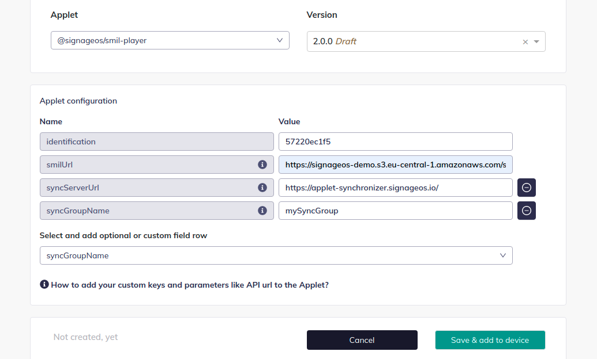

# Smil Synchronization Playback

Smil player supports the synchronization of multiple devices within the same group connected to the synchronization
server.

There are two things you have to set up. First, provide necessary parameters to each device in applet settings and then
mark which regions you want to synchronize in the smil file.

## Definition of the region with synchronization enabled

Add parameter `sync="true"` to a region you want to sync.

```xml

<region regionName="main" left="0" top="0" width="1920" height="1080" z-index="1" sync="true"/>
```

## Applet settings setup

| Configuration key | Description                                                                                                                                                                                                                               |
|-------------------|-------------------------------------------------------------------------------------------------------------------------------------------------------------------------------------------------------------------------------------------|
| `smilUrl`         | URL to your actual smil file                                                                                                                                                                                                              |
| `syncServerUrl`   | URL to the synchronization server. Default sync server in cloud is at https://applet-synchronizer.signageos.io/ but it's strongly recommended to use a local-hosted sync server for the best performance.                                 |
| `syncGroupName`   | identifies which devices should be synced together. All of the devices within the same group will be synced together, even if they are not in the same network. If no `syncGroupName` is specified, smil player will use the default one. |


