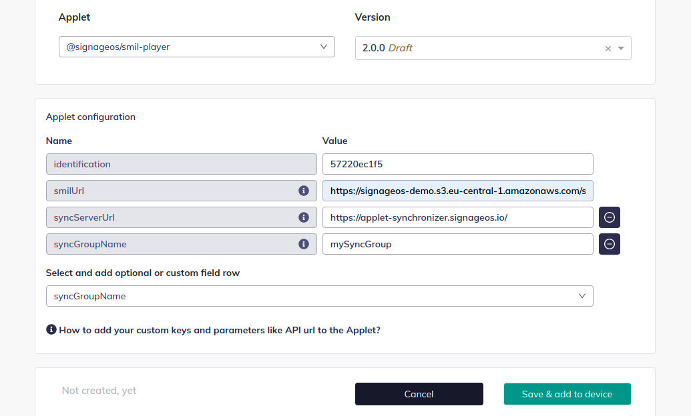

# Smil Synchronization Playback

Smil player supports synchronized playback of multiple devices within the same sync group.

There are two things you have to set up. First, provide necessary parameters to each device in applet settings and then
mark which regions you want to synchronize in the smil file.

## Definition of the region with synchronization enabled

Add parameter `sync="true"` to a region you want to sync.

```xml

<region regionName="main" left="0" top="0" width="1920" height="1080" z-index="1" sync="true"/>
```

Each synced region forms its **own** sync group (named `<syncGroupName>-<regionName>`) and is coordinated
independently — a playlist can have several synced regions, each electing its own coordination master. Regions without
`sync="true"` play independently on every device.

## Applet settings setup

Sync is configured entirely through applet configuration — `syncGroupName`, `syncServerUrl`, `syncGroupIds`, and
`syncDeviceId` — see the [Applet Configuration Reference](../../reference/applet-config.md) for the full option
details. None of them can be set from the SMIL file.



## How synchronization works

The devices coordinate through an ACK-based protocol. One device in each region's group is elected **master** (the
election is automatic, handled by the platform); the others are slaves. Every element passes through coordinated
phases — *prepare* (media is downloaded and pre-prepared on all devices before any of them shows it), *play*, and
*finish* — where the master broadcasts a command, slaves acknowledge, and the master signals when everyone may
proceed. This keeps devices in lockstep at element boundaries regardless of small timing differences.

Useful consequences you can rely on:

- **Automatic master failover.** If the master device goes offline, another device is promoted automatically and
  coordination continues — no SMIL or config changes needed.
- **Automatic resync.** A device that falls behind (slow decode, reboot, network blip) skips ahead to the group's
  current position instead of drifting. Seeing a lagging device skip a few elements to catch up is expected behaviour.
- **No dead-master freeze.** If a device stops receiving coordination messages entirely (master dead or unreachable),
  it waits through several coordination timeouts (roughly 3 minutes) and then continues playing its own content
  standalone. It rejoins coordination automatically as soon as messages arrive again.
- **Mixed SMIL versions don't freeze playback.** During a staged content-update rollout, devices briefly running
  different SMIL versions detect that their playlists no longer line up, keep playing their own content independently,
  and re-synchronize automatically once all peers are on the same version again.
- **Priority playlists stay in sync.** `<priorityClass>` content — including wallclock-scheduled campaign windows —
  is coordinated across the group, and devices transition between priority levels together.
- **`playMode="one"` stays identical across devices.** For random playlists, the master broadcasts its pick and
  slaves play the same element instead of making their own random choice. See
  [Random order playback](../layout-playlist/random-order-playback.md).

## Operational notes

- The content of the synced region should be the same on all devices (or at least element-by-element compatible in
  count and duration); the protocol aligns element boundaries, it does not resample differing timelines.
- On persistent sync-server connection errors the player reports the error and may restart the applet to recover.
- For the failover mechanism (another device taking over the content of a failed one), see
  [Trigger failover](failover.md).
- For synchronized dynamic (master-driven) content, see [Dynamic Synchronization](dynamic-synchronization.md).
