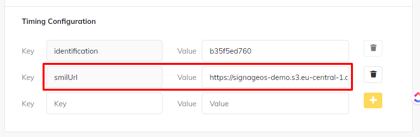

# Deploy SMIL Player Applet and playlist to any device

## Prerequisites

1. You have your SMIL Player available in your signageOS account, [learn how to build it here](how-to-build-smil-player-applet)
1. You uploaded the your SMIL Playlist to a server (local server, AWS S3, Azure Storage,...)

## Deployment options

From this point on, you can deploy your new SMIL Player Applet to [any device via Timing](https://docs.signageos.io/hc/en-us/articles/4405026786706), or simply [build your own native app - Core Apps](https://docs.signageos.io/hc/en-us/articles/4405245195666).

If you are using Timing to deploy your SMIL Player, you can add Timing Configuration `smilUrl` and as a value pass link to your SMIL playlist. 

By doing so, the SMIL playlist will be persistent throughout the reboots. And, of course, you can change it from Box anytime in the future.

