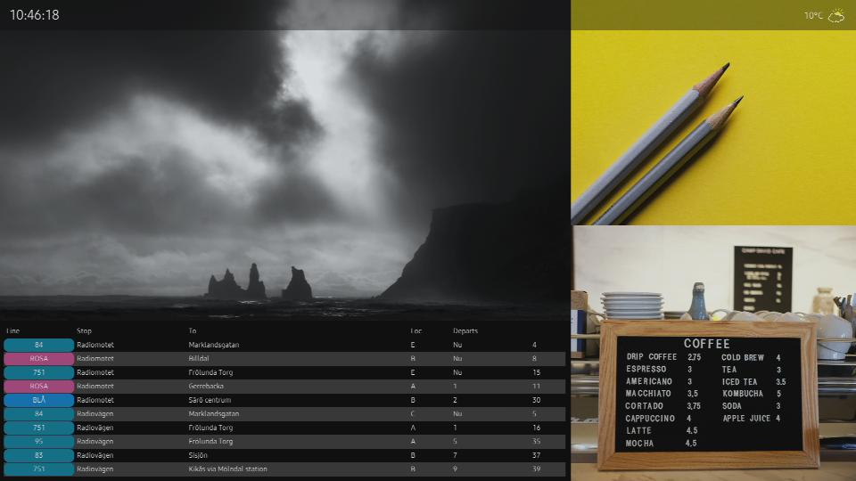
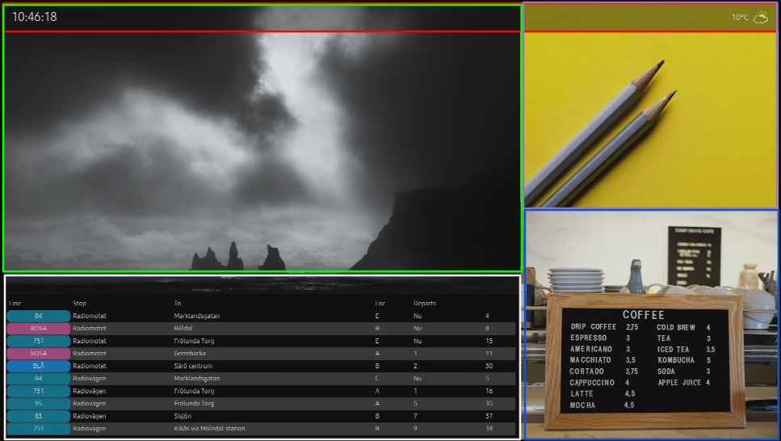

# Hello World SMIL playlist

## Introduction
In this guide, we will build a SMIL playlist that will feature regions, scheduled playback, widgets, and conditional playback.

Once you finish the guide, you will have a SMIL Playlist that can be played via SMIL Player.

The final playlist will look like this on the display:



We will build the SMIL Playlist in 5 easy-to-follow steps:
1. Layout definition
1. Preloader definition
1. Assigning media to regions
1. Scheduling definition
1. Conditional playback definition

## Prerequisites

1. You have your SMIL Player available in your signageOS account, [learn how to build it here](how-to-build-smil-player-applet)
1. You can upload the final SMIL Playlist to a server (local server, AWS S3, Azure Storage,...)

## 1. Layout definition

Our SMIL playlist has a complex layout. It has 5 regions (aka zones).

**Regions:**

1. topOverlay (red)
1. video (green)
1. bottomWidget (white)
1. topRightWidget (purple)
1. bottomRightWidget (blue)



Let's start with the basic SMIL playlist template:

```xml title="SMIL playlist definition template"
<smil>
  <head>
    <layout>
      <!-- Global layout definition here -->
    </layout>
  </head>
  <body>
    <!-- Contents here -->
  </body>
</smil>
```

Add the `<layout>` tag and the definition of screen regions.

```xml title="Adding layout definition and regions definition into the playlist"
<smil>
  <head>
    // highlight-start
    <layout>
      <!--
        - root layout defines the dimensions of the whole playlist and its orientation 
        - in our case the playlist is landscape oriented, 1920x1080
      -->
      <root-layout width="1920" height="1080" />

      <!-- 
        - now we can define each of the regions
        - region has always a regionName and a position (left, top), size (width, height)
        - region can also have a z-index to define layers within the layout (decide which one is on top)
      -->
			<region regionName="topOverlay" left="0" top="0" width="1920" height="68" z-index="9" backgroundColor="transparent" />

			<region regionName="video" left="0" top="0" width="1280" height="720" z-index="1"/>

			<region regionName="bottomWidget" left="0" bottom="0" width="1280" height="360" z-index="1"/>

			<region regionName="topRightWidget" left="1280" top="0" width="640" height="506" z-index="1"/>

			<region regionName="bottomRightWidget" left="1280" top="506" width="640" height="574" z-index="1"/>
    </layout>
    // highlight-end
  </head>
  <body>
    <!-- Contents here -->
  </body>
</smil>
```

Now we have our layout set. We can start adding media and widgets to the playlist.

## 2. Preloader definition

Sometimes, if your playlist is large or the network connection is not fast, you may want to show a placeholder video or image before all media files are cached and ready to play. For this use case there is a preloader.

In our case, we will use this following video:


The preloader is placed in the playlist body:

```xml title="Adding preloader into the playlist definition"
<smil>
  <head>
    <layout>
      <root-layout width="1920" height="1080" />

			<region regionName="topOverlay" left="0" top="0" width="1920" height="68" z-index="9" backgroundColor="transparent" />

			<region regionName="video" left="0" top="0" width="1280" height="720" z-index="1"/>

			<region regionName="bottomWidget" left="0" bottom="0" width="1280" height="360" z-index="1"/>

			<region regionName="topRightWidget" left="1280" top="0" width="640" height="506" z-index="1"/>

			<region regionName="bottomRightWidget" left="1280" top="506" width="640" height="574" z-index="1"/>
    </layout>
  </head>
  <body>
    <par>
      <!-- Preloader to show something before the full content is loaded and ready -->
			<!-- This <seq> will happen first followed by the next seq -->
			// highligh-start
            <seq end="__prefetchEnd.endEvent">
				<seq repeatCount="indefinite">
					<!-- Play waiting prompt -->
					<video src="https://signageos-demo.s3.eu-central-1.amazonaws.com/smil/zones/files/loader.mp4" />
				</seq>
             // highlight-end
      </seq>
    </par>
  </body>
</smil>
```

## 3. Adding media to regions
As a next step we put media in each of the respective region.

```xml title="Adding media with paralel and sequence playlist"
<!-- 
  - the following parallel playlist will start once all media are cached 
  - it will automatically end the preloader
-->
<par begin="__prefetchEnd.endEvent" repeatCount="indefinite">

  <!-- 
    - playlist is separated to <par> for each region
    - parallel playlists are playing at the same time
  -->
  <par>
    <seq repeatCount="indefinite">
      <!-- here we add topOverlay widget and assign it to region with name topOverlay (names are matching to make it more obvious, it's not mandatory using same names) -->
      <ref src="https://signageos-demo.s3.eu-central-1.amazonaws.com/smil/zones/files/topOverlay.wgt" type="application/widget" region="topOverlay" dur="60s"></ref>
    </seq>
  </par>

  <par>
    <seq repeatCount="indefinite">
      <!-- second widget in the bottomRight region -->
      <ref src="https://signageos-demo.s3.eu-central-1.amazonaws.com/smil/zones/files/bottomWidget.wgt" type="application/widget" region="bottomWidget" dur="60s"></ref>
    </seq>
  </par>

  <par>
    <seq repeatCount="indefinite">
      <!-- loop of images in the topRightWidget region -->
      </img>
      </img>
      </img>
    </seq>
  </par>

  <par>
    <seq repeatCount="indefinite">
      <!-- loop of images in the bottomRightWidget region -->
      </img>
      </img>
      </img>
    </seq>
  </par>

  <seq repeatCount="indefinite">
    <!-- loop of videos and images in the 'video' region -->
    <video src="https://signageos-demo.s3.eu-central-1.amazonaws.com/smil/zones/files/video_1.mp4" region="video"></video>
    <video src="https://signageos-demo.s3.eu-central-1.amazonaws.com/smil/zones/files/video_2.mp4" region="video"></video>
    </img>
    </img>
  </seq>

</par>
```

At his stage, we finished a basic playlist creation. The playlist is capable of playing various videos, images and widgets in their respected regions.

Our current playlist looks like this:

```xml title="Current state of the SMIL playlist file with regions, preloader and media"
<smil>
  <head>
    <layout>
      <root-layout width="1920" height="1080" />
			<region regionName="topOverlay" left="0" top="0" width="1920" height="68" z-index="9" backgroundColor="transparent" />
			<region regionName="video" left="0" top="0" width="1280" height="720" z-index="1"/>
			<region regionName="bottomWidget" left="0" bottom="0" width="1280" height="360" z-index="1"/>
			<region regionName="topRightWidget" left="1280" top="0" width="640" height="506" z-index="1"/>
			<region regionName="bottomRightWidget" left="1280" top="506" width="640" height="574" z-index="1"/>
    </layout>
  </head>
  <body>
    <par>

			<seq end="__prefetchEnd.endEvent">
				<seq repeatCount="indefinite">
					<video src="https://signageos-demo.s3.eu-central-1.amazonaws.com/smil/zones/files/loader.mp4" />
				</seq>
      </seq>

      <par begin="__prefetchEnd.endEvent" repeatCount="indefinite">
        <par>
          <seq repeatCount="indefinite">
            <ref src="https://signageos-demo.s3.eu-central-1.amazonaws.com/smil/zones/files/topOverlay.wgt" type="application/widget" region="topOverlay" dur="60s"></ref>
          </seq>
        </par>

        <par>
          <seq repeatCount="indefinite">
            <ref src="https://signageos-demo.s3.eu-central-1.amazonaws.com/smil/zones/files/bottomWidget.wgt" type="application/widget" region="bottomWidget" dur="60s"></ref>
          </seq>
        </par>

        <par>
          <seq repeatCount="indefinite">
            </img>
            </img>
            </img>
          </seq>
        </par>

        <par>
          <seq repeatCount="indefinite">
            </img>
            </img>
            </img>
          </seq>
        </par>

        <par>
          <seq repeatCount="indefinite">
            <video src="https://signageos-demo.s3.eu-central-1.amazonaws.com/smil/zones/files/video_1.mp4" region="video"></video>
            <video src="https://signageos-demo.s3.eu-central-1.amazonaws.com/smil/zones/files/video_2.mp4" region="video"></video>
            </img>
            </img>
          </seq>
        </par>

      </par>
    </par>
  </body>
</smil>
```

## 4. Scheduling
As a next step, we want to alter the content of the video region based on date. We will create a content that will be scheduled to play from 30th June 2025 to 31st July 2025.

To do so, we will wrap the media in video region in the priorityClass.

```xml title="Adding priority class as a way of scheduling content for define time period"
<excl>
  <!-- All your priority playlists for a certain region ordered by priority -->

  <priorityClass higher="stop" lower="defer" peer="stop">
    <!-- 
      - the first priorityClass will be active from 30th of Jan to 31st of Jul 
      - it will alter the "standard" loop in video region during this time
    -->
    <par begin="wallclock(2025-06-30T00:00:00)" end="wallclock(2021-07-31T00:00:00)">
      <seq repeatCount="indefinite">
          <video src="https://signageos-demo.s3.eu-central-1.amazonaws.com/smil/zones/files/video_3.mp4" region="video"></video>
          </img>
        </seq>
    </par>
  </priorityClass>
  
  <!-- the second priorityClass will be active any other day but 1st and 2nd of Jan -->
  <priorityClass higher="stop" lower="defer" peer="stop">
    <par>
      <seq repeatCount="indefinite" begin="0">
          <video src="https://signageos-demo.s3.eu-central-1.amazonaws.com/smil/zones/files/video_1.mp4" region="video"></video>
          <video src="https://signageos-demo.s3.eu-central-1.amazonaws.com/smil/zones/files/video_2.mp4" region="video"></video>
          </img>
          </img>
      </seq>
    </par>
  </priorityClass>
</excl>
```

## 5. Conditional playback
As a last item we want to define which image in the topRightWidget region will be visible which day of the week.

To achieve different playback during different days of the week, we use conditional logic

```xml title="Defining conditions based on days in a week"
<par>
  <seq repeatCount="indefinite">
    <!-- 
      - expr defines a condition, if the condition is met, the item (in this case image) is played, otherwise is skipped
    -->
    </img>
    =1 and adapi-weekday()<=5" src="https://signageos-demo.s3.eu-central-1.amazonaws.com/smil/zones/files/img_3.jpg" region="topRightWidget" dur="60s"></img>
    </img>
  </seq>
</par>
```

- The first image will be visible only on Sunday `(adapi-weekday()=0)`
- The second image will be visible from Monday `(adapi-weekday()>=1)` till Friday `(adapi-weekday()<=5)`
- The third image will be visible only on Saturday `(adapi-weekday()=6)`

## Final SMIL Playlist

We are done. The playlist now is playing content in 5 various regions. In the video region it schedules a playback of special video from 30th of June till 31st July, otherwise it plays standard loop of videos and images. In the topRightWidget are images shown based on the exact day of the week.

```xml title="Complete final Hello World SMIL playlist file"
<smil>
  <head>
    <layout>
      <root-layout width="1920" height="1080" />
			<region regionName="topOverlay" left="0" top="0" width="1920" height="68" z-index="9" backgroundColor="transparent" />
			<region regionName="video" left="0" top="0" width="1280" height="720" z-index="1"/>
			<region regionName="bottomWidget" left="0" bottom="0" width="1280" height="360" z-index="1"/>
			<region regionName="topRightWidget" left="1280" top="0" width="640" height="506" z-index="1"/>
			<region regionName="bottomRightWidget" left="1280" top="506" width="640" height="574" z-index="1"/>
    </layout>
  </head>
  <body>
    <par>

			<seq end="__prefetchEnd.endEvent">
				<seq repeatCount="indefinite">
					<video src="https://signageos-demo.s3.eu-central-1.amazonaws.com/smil/zones/files/loader.mp4" />
				</seq>
      </seq>

      <par begin="__prefetchEnd.endEvent" repeatCount="indefinite">
        <par>
          <seq repeatCount="indefinite">
            <ref src="https://signageos-demo.s3.eu-central-1.amazonaws.com/smil/zones/files/topOverlay.wgt" type="application/widget" region="topOverlay" dur="60s"></ref>
          </seq>
        </par>

        <par>
          <seq repeatCount="indefinite">
            <ref src="https://signageos-demo.s3.eu-central-1.amazonaws.com/smil/zones/files/bottomWidget.wgt" type="application/widget" region="bottomWidget" dur="60s"></ref>
          </seq>
        </par>

        <par>
          <seq repeatCount="indefinite">
            <!-- 
              - expr defines a condition, if the condition is met, the item (in this case image) is played, otherwise is skipped
            -->
            </img>
            =1 and adapi-weekday()<=5" src="https://signageos-demo.s3.eu-central-1.amazonaws.com/smil/zones/files/img_3.jpg" region="topRightWidget" dur="60s"></img>
            </img>
          </seq>
        </par>

        <par>
          <seq repeatCount="indefinite">
            </img>
            </img>
            </img>
          </seq>
        </par>

        <par>
          <excl>
            <priorityClass higher="stop" lower="defer" peer="stop">
              <par begin="wallclock(2025-06-30T00:00:00)" end="wallclock(2021-07-31T00:00:00)">
                <seq repeatCount="indefinite">
                    <video src="https://signageos-demo.s3.eu-central-1.amazonaws.com/smil/zones/files/video_3.mp4" region="video"></video>
                    </img>
                  </seq>
              </par>
            </priorityClass>

            <priorityClass higher="stop" lower="defer" peer="stop">
              <par>
                <seq repeatCount="indefinite" begin="0">
                    <video src="https://signageos-demo.s3.eu-central-1.amazonaws.com/smil/zones/files/video_1.mp4" region="video"></video>
                    <video src="https://signageos-demo.s3.eu-central-1.amazonaws.com/smil/zones/files/video_2.mp4" region="video"></video>
                    </img>
                    </img>
                </seq>
              </par>
            </priorityClass>
          </excl>
        </par>
      </par>
    </par>
  </body>
</smil>
```

This is just the beginning. Let's explore how SMIL player can streamline your use case. Explore supported media types as well as advanced functionality.

## Next steps
Now you have your first SMIL Playlist. To proceed further and see your content running, follow these steps:

1. Save the playlist as *.smil file (e.g. sample-playlist.smil)
1. Upload the file to a server (the local one, AWS S3, Azure Storage, or similar)
1. Build the SMIL Player
1. Deploy the playlist