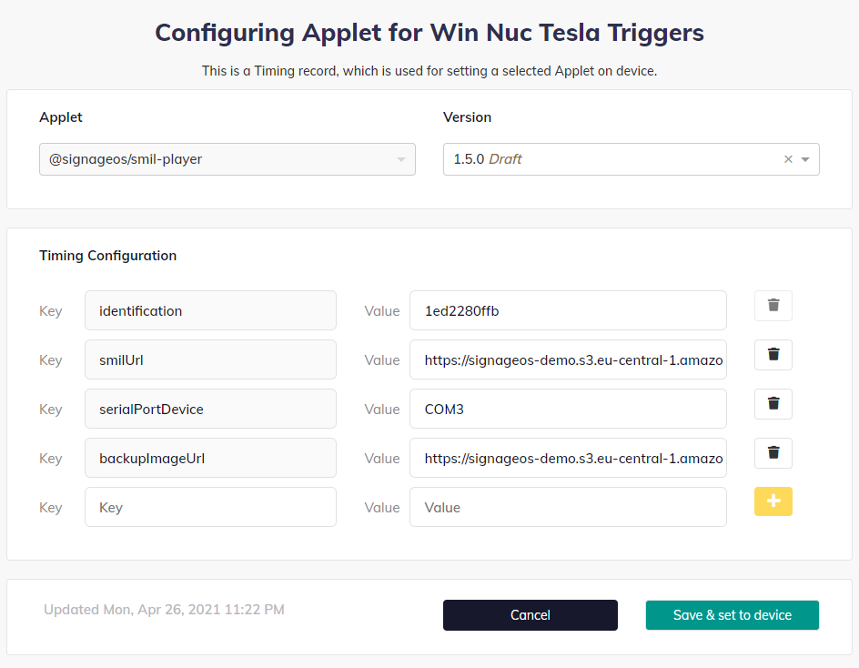

# SMIL Player Configuration
You can configure certain parameters of the SMIL Player using Timing Configuration. Here is the list of built-in options:

- `smilUrl` is used for passing URL of the smil file, no default
- `backupImageUrl` is used for defining a failover image that will be shown in case the smil file is corrupted or fatal error occurs during playback, default built-in image
- `serialPortDevice` is used for defining custom device address used for serial communication (like Nexmosphere sensors), default is /device/ttyUSB0
- `videoBackground` this value accepts True and False values, resulting in a video content playing in the background

