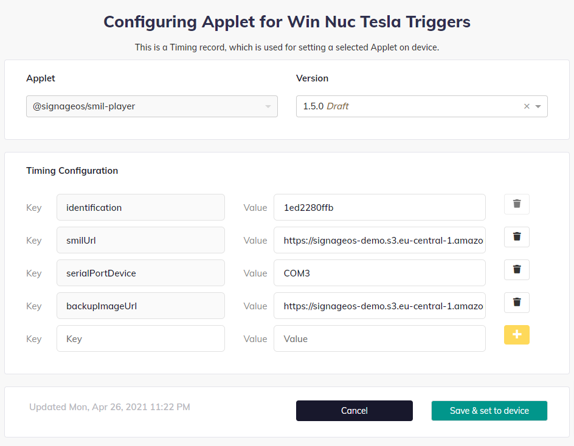

# Applet Configuration Reference

You can configure certain parameters of the SMIL Player using Timing Configuration:

Here is the list of built-in options:

| Option | Type | Required | Default | Description |
|---|---|---|---|---|
| `smilUrl` | string (URL) | yes | none | Used for passing URL of the smil file. |
| `backupImageUrl` | string (URL) | no | built-in image | Used for defining a failover image that will be shown in case the smil file is corrupted or fatal error occurs during playback. |
| `serialPortDevice` | string | no | `/dev/ttyUSB0` | Used for defining custom device address used for serial communication (like Nexmosphere sensors). |
| [`videoBackground`](#videobackground) | boolean | no | unset | This value accepts `true` and `false` values; when `true`, videos play on the background video plane, allowing HTML content to be layered above them. |
| [`reportUrl`](#reporturl) | string (URL) | no | unset | Custom reporting endpoint URL. |
| [`syncGroupName`](#syncgroupname) | string | **yes**, for sync | none | Identifies which devices should be synchronised together. |
| [`syncServerUrl`](#syncserverurl) | string (URL) | no | unset (local P2P) | URL of the synchronisation server. |
| [`syncGroupIds`](#syncgroupids) | string (comma-separated) | no (required for failover triggers) | none | Comma-separated list of the device identifiers in the sync group. |
| [`syncDeviceId`](#syncdeviceid) | string | no (required for failover triggers) | random per boot | This device's identifier within `syncGroupIds`. |
| `debugEnabled` | boolean | no | `false` | Set to `true` to enable debug logging output. |

## `videoBackground`

**Type:** boolean · **Default:** unset · **Applies to:** applet configuration

Setting `videoBackground: "true"` requires no rebuild — the player reads it from the applet configuration at
startup. With it enabled, videos play on the background video plane and images/widgets can be layered above them
(you still cannot layer videos on top of each other).

Used in: [Video](../guides/media/videos.md)

## `reportUrl`

**Type:** string (URL) · **Default:** unset · **Applies to:** applet configuration

Custom reporting endpoint URL. When set, the player POSTs proof-of-play reports to this endpoint. It overrides the
`endpoint` from the SMIL `<meta>` logging configuration, force-enables reporting, and *adds* the proof-of-play type
to whatever logging types the SMIL file configures (it does not replace them).

Used in: [Setting Up Reporting](../guides/reporting/setup.md)

## `syncGroupName`

**Type:** string · **Default:** none · **Applies to:** applet configuration

Identifies which devices should be synchronised together. **Required** for any synchronization — without it the
player skips sync setup entirely (there is no default group). Config-only; it cannot be set via the SMIL `<meta>`
tag. Use a unique name per group so groups don't interfere.

Used in: [Playback Synchronization](../guides/synchronization/playback-synchronization.md)

## `syncServerUrl`

**Type:** string (URL) · **Default:** unset (local P2P) · **Applies to:** applet configuration

URL of the synchronisation server (e.g. a self-hosted applet-synchronizer). When set, devices coordinate through
that server (works across networks). When omitted, the player falls back to **local-network peer-to-peer**
(UDP/TCP) — devices must be on the same LAN; no cloud server is contacted. Config-only; the SMIL `<meta>` tag is not
consulted.

Used in: [Playback Synchronization](../guides/synchronization/playback-synchronization.md)

## `syncGroupIds`

**Type:** string (comma-separated) · **Default:** none · **Applies to:** applet configuration

Comma-separated list of the device identifiers in the sync group. Required for the sync failover triggers. Note:
when set, sync coordination automatically suspends (devices free-run) whenever any listed device is offline, and
resumes when all are back. Leave it empty if you don't want that behaviour.

Used in: [Playback Synchronization](../guides/synchronization/playback-synchronization.md), [Trigger Failover](../guides/synchronization/failover.md)

## `syncDeviceId`

**Type:** string · **Default:** random per boot · **Applies to:** applet configuration

This device's identifier within `syncGroupIds`. Required for failover triggers; when omitted, a random identifier
is generated on each boot.

Used in: [Playback Synchronization](../guides/synchronization/playback-synchronization.md), [Trigger Failover](../guides/synchronization/failover.md)

> All four sync options above (`syncGroupName`, `syncServerUrl`, `syncGroupIds`, `syncDeviceId`) are applet
> configuration values — they cannot be set from the SMIL file.
